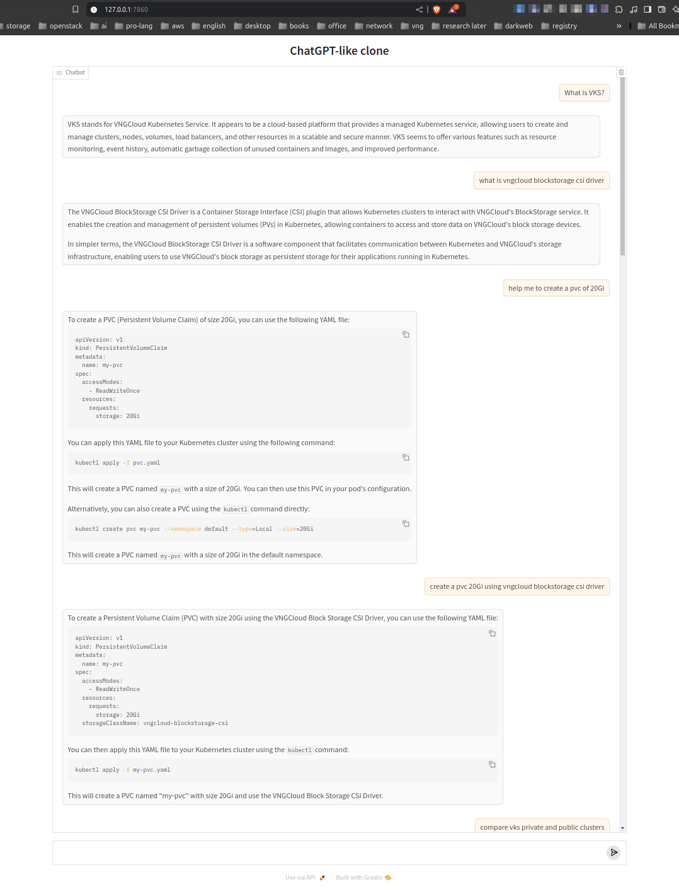

# ChatGPT-like clone

_This is just a small project for lab purposes. NOT for production._
<hr>

###### 🌈 Table of Contents

- [Next plans](#next-plans)
- [Overview](#overview)
- [Installation](#installation)

<hr>

# Next plans

- [ ] Deploy it on Kubernetes.
- [ ] Streaming messages.
- [x] Multi-session support.

# Overview

- **ChatGPT-like one** is a web-chat application using Gradio and Haystack.
  

# Installation

- To run it:
    - Enable GPU in
      Docker [https://github.com/ollama/ollama/blob/main/docs/docker.md](https://github.com/ollama/ollama/blob/main/docs/docker.md):
      ```bash
      curl -fsSL https://nvidia.github.io/libnvidia-container/gpgkey \
          | sudo gpg --dearmor -o /usr/share/keyrings/nvidia-container-toolkit-keyring.gpg
      curl -s -L https://nvidia.github.io/libnvidia-container/stable/deb/nvidia-container-toolkit.list \
          | sed 's#deb https://#deb [signed-by=/usr/share/keyrings/nvidia-container-toolkit-keyring.gpg] https://#g' \
          | sudo tee /etc/apt/sources.list.d/nvidia-container-toolkit.list
      sudo apt-get update
  
      sudo apt-get install -y nvidia-container-toolkit
  
      sudo nvidia-ctk runtime configure --runtime=docker
  
      sudo systemctl restart docker
      ```

    - Run Ollama in Docker integrated with GPU:
      ```bash
      docker run -d --gpus=all -v ollama:/root/.ollama -p 11434:11434 --name ollama ollama/ollama
      docker exec ollama ollama pull llama3.1:8b
    - Run the Gradio ChatApp:
      ```bash
      python3 main.py
      ```