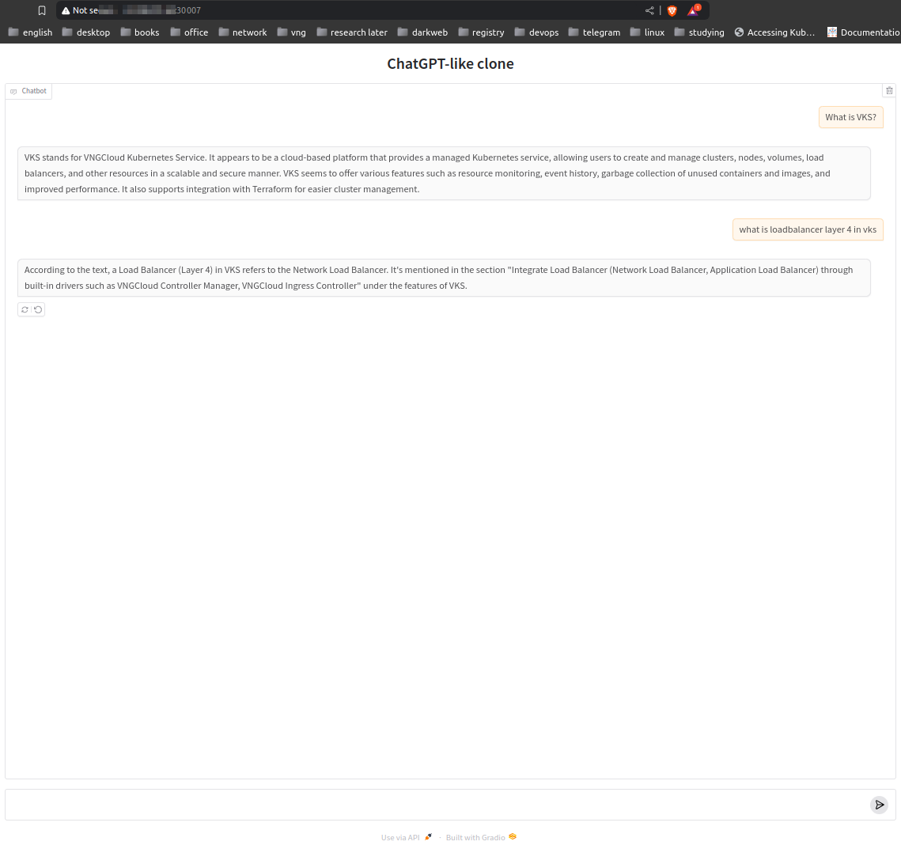

# ChatGPT-like clone

_This is just a small project for lab purposes. NOT for production._
<hr>

###### 🌈 Table of Contents

- [Environment](#environment)
- [Next plans](#next-plans)
- [Overview](#overview)
- [Installation](#installation)
  - [Local](#local)
  - [Kubernetes](#kubernetes)

<hr>

# Environment
- Ubuntu 22.04 LTS (Desktop/Cloud Server)
- GPU NVIDIA RTX 3070Ti or RTX 4090Ti _(tested both)_
- Your server has been installed `nvidia-smi`, using `sudo ubuntu-drivers autoinstall` to install the driver. I am using the latest driver version:
  ```bash
  stackops@cuongdm3-voldemort:~$ nvidia-smi --version
  NVIDIA-SMI version  : 550.120
  NVML version        : 550.120
  DRIVER version      : 550.120
  CUDA Version        : 12.4
  ```

# Next plans

- [ ] Integrated with Triton Inference Server.
- [x] Deploy it on Kubernetes.
- [ ] Streaming messages.
- [x] Multi-session support.

# Overview

- **ChatGPT-like clone** is a web-chat application using Gradio and Haystack.
- Currently, I am using `llama3.1:8b` model as the default model.
- The model is running in a **Ollama** Docker container with **GPU support**.
  

# Installation
## Local
- To run it:
    - Enable GPU in
      Docker [https://github.com/ollama/ollama/blob/main/docs/docker.md](https://github.com/ollama/ollama/blob/main/docs/docker.md):
      ```bash
      curl -fsSL https://nvidia.github.io/libnvidia-container/gpgkey \
          | sudo gpg --dearmor -o /usr/share/keyrings/nvidia-container-toolkit-keyring.gpg
      curl -s -L https://nvidia.github.io/libnvidia-container/stable/deb/nvidia-container-toolkit.list \
          | sed 's#deb https://#deb [signed-by=/usr/share/keyrings/nvidia-container-toolkit-keyring.gpg] https://#g' \
          | sudo tee /etc/apt/sources.list.d/nvidia-container-toolkit.list
      sudo apt-get update
  
      sudo apt-get install -y nvidia-container-toolkit
  
      sudo nvidia-ctk runtime configure --runtime=docker
  
      sudo systemctl restart docker
      ```

    - Run Ollama in Docker integrated with GPU:
      ```bash
      docker run -d --gpus=all -v ollama:/root/.ollama -p 11434:11434 --name ollama ollama/ollama
      docker exec ollama ollama pull llama3.1:8b
      ```
    - Run the Gradio ChatApp:
      ```bash
      python3 main.py
      ```
    - Visit [http://localhost:7860](http://localhost:7860) to chat with the model.
    

## Kubernetes
- If you tend to deploy this application on Kubernetes, apply the manifest [app.yaml](./app.yaml), then access the application by the public IP of the worker nodes on port `30007`.
  ```yaml
  # File app.yaml
  apiVersion: apps/v1
  kind: Deployment
  metadata:
    name: chatgpt-clone-deployment
  spec:
    replicas: 1
    selector:
      matchLabels:
        app: chatgpt-clone
    template:
      metadata:
        labels:
          app: chatgpt-clone
      spec:
        containers:
        - name: chatgpt-clone
          image: vcr.vngcloud.vn/60108-cuongdm3/chatgpt-like-clone:base
          command: ["python"]
          args: ["main.py", "http://ollama33.ollama"]  # please chaage the ollama server address
          ports:
          - containerPort: 7860
        nodeSelector:
          vks.vngcloud.vn/nodegroup: nodegroup-27051 
  ---
  apiVersion: v1
  kind: Service
  metadata:
    name: chatgpt-clone-service
  spec:
    selector:
      app: chatgpt-clone
    type: NodePort
    ports:
    - protocol: TCP
      port: 80
      targetPort: 7860
      nodePort: 30007 # Specify a fixed NodePort (optional) or let Kubernetes choose
  ```

  